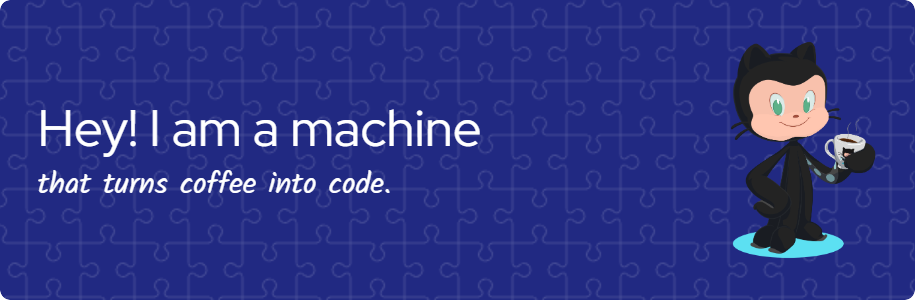

## Hi 👋, I'm Aman Kumar Singh 

- 🚀 Aspiring **web developer** with a passion for creating user-friendly web applications
- 🎓 Final-year **B.Tech** student in **Information Technology** at KIIT University
- 💡 Continuously exploring new technologies and improving my skills
- 🌱 Learning in public and eager to collaborate with the developer community
- 🔗 Always open to contributing to open-source projects and sharing my journey

## 🌐 Socials:
  

# 💻 Tech Stack:
               
# 📊 GitHub Stats:
 
 

### ✍️ Random Dev Quote

---

<!-- Proudly created with GPRM ( https://gprm.itsvg.in ) -->
